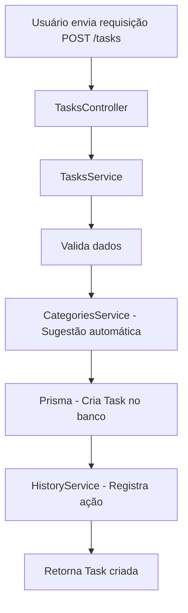
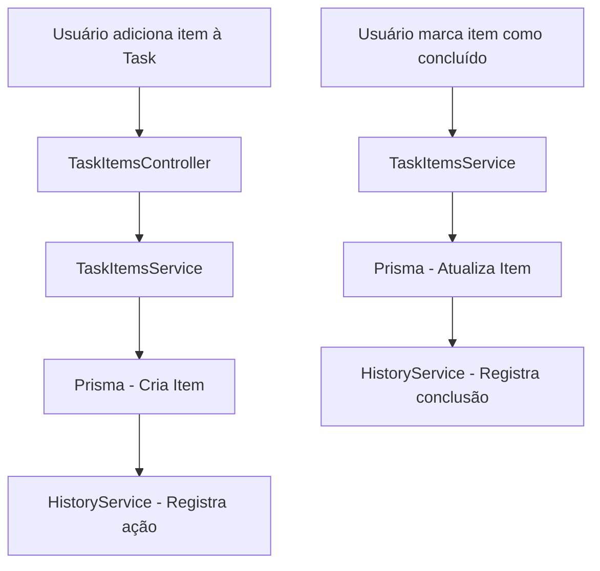
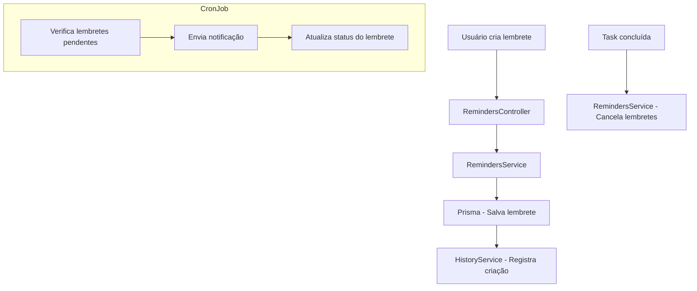
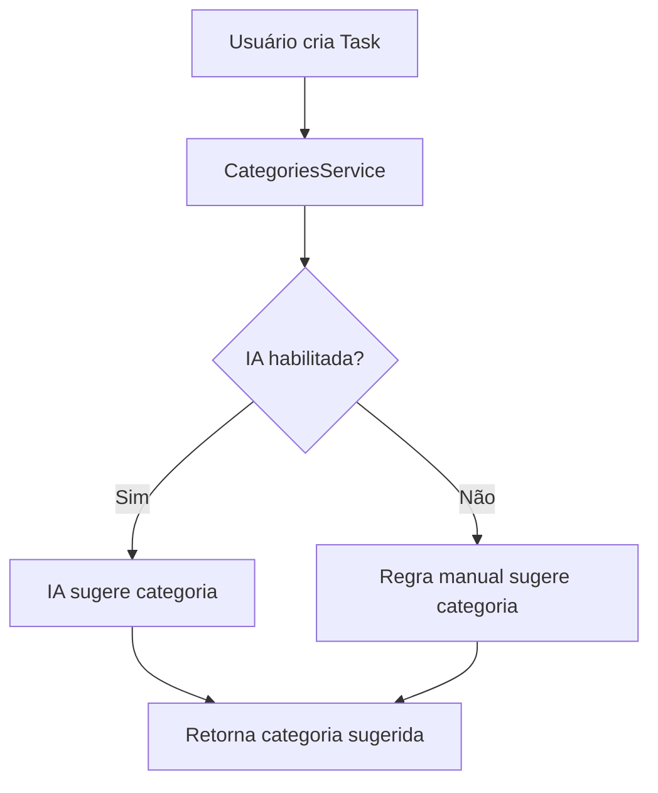
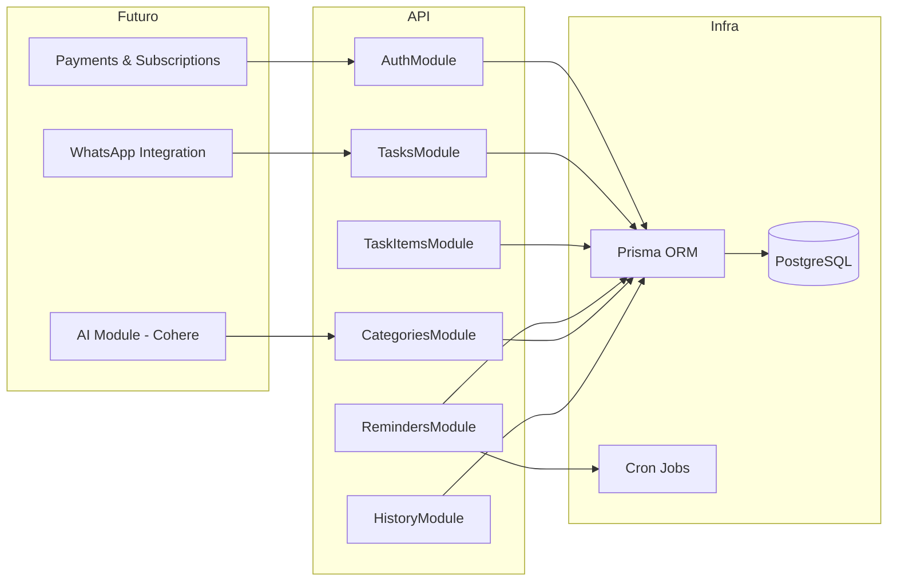

# 📊 Diagramas do Sistema Donna

Este documento reúne todos os diagramas oficiais do projeto Donna, incluindo:

- Fluxo de criação de tasks  
- Fluxo de itens  
- Fluxo de lembretes  
- Fluxo de categorias  
- Arquitetura geral do sistema  

Todos os diagramas estão em **Mermaid**, permitindo visualização direta no GitHub.

---

## 📝 1. Fluxo de Criação de Tasks

---

## 🧩 2. Fluxo de Itens (TaskItems)

---

## ⏰ 3. Fluxo de Lembretes

---

## 🏷️ 4. Fluxo de Categorias

---

## 🏗️ 5. Arquitetura Geral do Sistema

---

## 📌 Observações

- Todos os fluxos representam o comportamento atual do backend.  
- Módulos futuros já estão mapeados para facilitar evolução.  
- Diagramas podem ser atualizados conforme novas US forem concluídas.